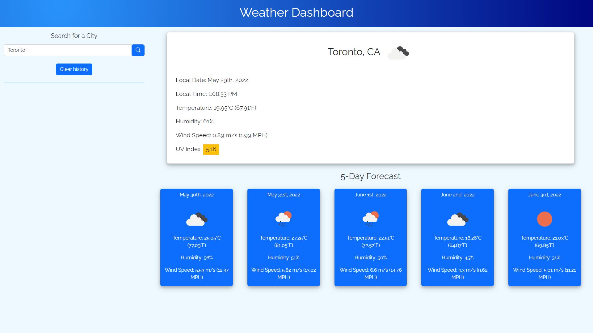
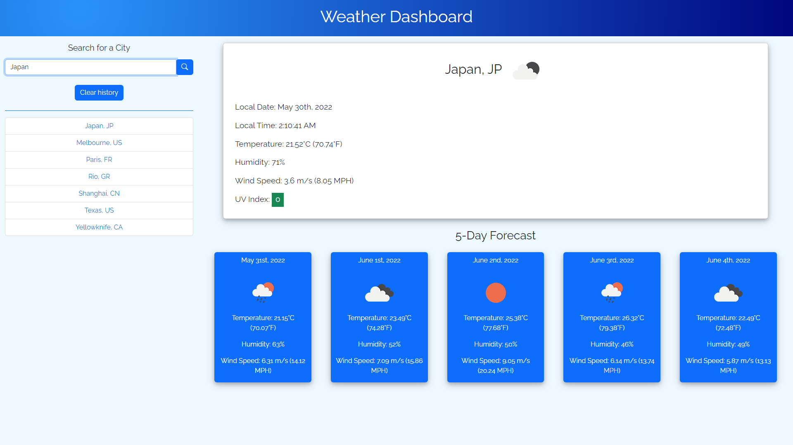

# Weather Dashboard
> By Richard Zhang

## Description

- The motivation behind this project was to learn how to incorporate server-side APIs into the creation of an application.
- This project was created to better understand the fetch function, promises and responses, and how to interpret and extract the information returned from a server-side API. This project was also used to further enhanced my understanding of JavaScript, JQuery, functions, and the interplay between JavaScript, HTML, CSS, and APIs.
- The Weather Dashboard can be used to search for weather data from most cities around the world. It also displays the 5-day forecast, and the local date and time which is updated in real-time. The user's search history is automatically saved to the application in a consistent format in alphabetical order, and can be cleared by the user.
- Through this project, I learned how powerful server-side APIs can be. The API used for this project was OpenWeather, which provided an incredible amount of data for a specific thing: weather data. I learned how to interpret the data returned from a server-side API, and how to better understand the documentation for APIs in general.
- I'm proud of what I created in this project. I think I added some nice quality of life features that enhanced the weatherboard's usability. I'm also happy with how the dashboard looks and the logic I used. However, I think the functions are a bit redundant, and I could have written the code better in line with the DRY principle.

##  Link and Screenshots

> [Link to the live application](https://richardzhang01.github.io/weather-dashboard/)

## Technologies Used

- HTML
- CSS
- JavaScript
- [Bootstrap](https://getbootstrap.com/)
- [Google Fonts](https://fonts.google.com/)
- [JQuery](https://jquery.com/)
- [Moment.js](https://momentjs.com/)
- [OpenWeather - Weather API](https://openweathermap.org/api)
